# Architecture

## SDK Layers

The SDK is organized into three layers. Each layer only depends on the one below it.

```mermaid
graph TB
    A["🤖 tools/<br/>ErgoToolkit, SafetyConfig<br/>OpenAI / Anthropic / LangChain schemas"] --> B
    B["💱 defi/<br/>OracleReader, SpectrumDEX"] --> C
    C["⛓️ core/<br/>ErgoNode, Wallet, TransactionBuilder, Address"]
    
    style A fill:#7c3aed,color:#fff
    style B fill:#f59e0b,color:#000
    style C fill:#10b981,color:#fff
```

### Core Layer (`ergo_agent.core`)

The foundation. Handles all direct blockchain interaction.

| Class | Purpose |
|---|---|
| `ErgoNode` | REST client for the Explorer API and node API |
| `Wallet` | Address management and transaction signing |
| `TransactionBuilder` | UTXO selection, fee calculation, change handling |
| `address` | Base58 validation, ErgoTree derivation, checksum verification |
| `privacy` | $CASH v3 ring-signature pool interactions and NUMS generators |
| `models` | Data classes: `Box`, `Balance`, `Token`, `Transaction`, `SwapQuote` |

### DeFi Layer (`ergo_agent.defi`)

Protocol-specific adapters built on top of core.

| Class | Purpose |
|---|---|
| `OracleReader` | Reads ERG/USD price from Oracle Pool v2 |
| `SpectrumDEX` | Markets, swap quotes, and order construction for Spectrum Finance |

### Tools Layer (`ergo_agent.tools`)

The AI-facing interface. Wraps everything into LLM-compatible tool calls.

| Class | Purpose |
|---|---|
| `ErgoToolkit` | Main entry point — 7 tools, JSON output, `execute_tool()` dispatch |
| `SafetyConfig` | Per-tx limits, daily caps, rate limiting, contract whitelist |
| `to_openai_tools()` | OpenAI function-calling schema |
| `to_anthropic_tools()` | Anthropic tool use schema |
| `to_langchain_tools()` | LangChain `@tool` wrappers |

---

## How Ergo's eUTXO Model Works

!!! info "For developers coming from EVM"
    If you're used to Ethereum, Ergo's model is fundamentally different. This section explains the key concepts.

### Boxes, Not Accounts

Ergo doesn't have accounts with balances. Instead, it uses **boxes** (enhanced UTXOs):

```mermaid
graph LR
    subgraph "Transaction"
        direction LR
        I1["📦 Input Box<br/>5 ERG"] --> TX["🔄 Tx"]
        TX --> O1["📦 Output Box 1<br/>3 ERG → recipient"]
        TX --> O2["📦 Output Box 2<br/>1.999 ERG → change"]
        TX --> O3["📦 Output Box 3<br/>0.001 ERG → fee"]
    end
```

- **Input boxes** are consumed (destroyed) by the transaction
- **Output boxes** are created by the transaction
- The sum of inputs must equal the sum of outputs (conservation)
- Your "balance" is the sum of all unspent boxes at your address

### What Makes Ergo Boxes Special

Unlike Bitcoin UTXOs, Ergo boxes have:

| Feature | Description |
|---|---|
| **ErgoTree** | A script (compiled ErgoScript) that defines spending conditions |
| **Registers R0–R9** | Typed data storage — R0 is value, R1 is script, R4–R9 are custom |
| **Tokens** | Each box can hold multiple tokens alongside ERG |
| **Creation height** | Block height when the box was created |

This is why the SDK has a `TransactionBuilder` — constructing a transaction means selecting input boxes, creating output boxes, and handling change.

### Advanced Cryptography: $CASH v3 Ring Signatures

Because Ergo uses Sigma Protocols natively, the SDK's `TransactionBuilder` and `privacy` modules support advanced zero-knowledge proofs like **Ring Signatures** out of the box. For example, $CASH v3 creates application-level privacy pools:

1. **Deposit**: A user adds their public key to a `PoolBox` (in register `R4`) and deposits tokens.
2. **Withdrawal**: The user generates a ring signature (`proveDlog` combined with `proveDHTuple`) proving they own *one* of the keys in the pool, without revealing which one. They spend the key image (nullifier) to prevent double spending.

The SDK abstracts this complexity via the `privacy.py` module, which exposes `build_pool_deposit_tx` and `build_pool_withdraw_tx`.

### How the SDK Handles This

The agent never sees UTXOs, box IDs, or ErgoTrees. It just calls `send_erg()` and gets back a transaction ID.

---

## Safety Architecture

```mermaid
graph LR
    A["Agent calls<br/>send_erg()"] --> B{"SafetyConfig"}
    B -->|"✅ passes"| C["Execute"]
    B -->|"❌ per-tx limit"| D["SafetyViolation"]
    B -->|"❌ daily limit"| D
    B -->|"❌ rate limit"| D
    B -->|"❌ contract not whitelisted"| D
```

Every state-changing action passes through `SafetyConfig` before execution. The safety layer is **not optional** — even if you don't configure it, sensible defaults apply.

| Guard | Default | Purpose |
|---|---|---|
| `max_erg_per_tx` | 100 ERG | Prevent single catastrophic transaction |
| `max_erg_per_day` | 1000 ERG | Rolling 24h spending cap |
| `rate_limit_per_hour` | 60 | Prevent runaway loops |
| `allowed_contracts` | `[]` (any) | Whitelist protocols the agent can interact with |
| `dry_run` | `False` | Log but don't execute (for testing) |
